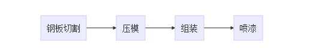
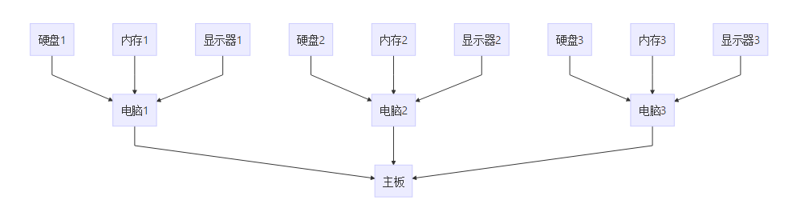

## 前言
接口和抽象类是面向对象的两个重要概念，接口仅是方法定义和常量值定义的集合，方法没有函数体；抽象类定义的内容理论上要比接口的多，可以定义普通类包含的所有内容，还可以定义抽象方法。接口和抽象类都不能实例化，必须在子类中实现方法，才能获得应用。

java语言为反应 "思考-实现"过程，通过不同的关键词来实现，即用接口interface和abstract来反应思考阶段，用子类Class来反应实现阶段。接口和抽象类只提出哪些问题需要解决，子类来实现具体怎么解决。

## 接口和抽象类的区别
接口主要是描述 "顺序问题"，抽象类描述 "顺序+共享"问题

下面是一个简易造车流程：



抽象成接口如下：

```java
interface ICar{
    void cut();
    void press();
    void composite();
    void color();
}
```
抽象类与接口不同，下面是一个组装多种价位，不同需求的电脑；



从上图可以看出，要配置n种电脑，每种电脑的硬盘、内存、显示器是不同类型的，主板是相同类型的。可以看出主板是共享型的，转化为抽象类如下：


```java
abstruct Class Computer{
    abstruct void makeHarddisk();//硬盘
    abstruct void makeMemory();//内存
    abstruct void makeScreen();//显示屏
    void makeMainBoard();//主板
}
```

实例演示：
1、求数组最大值


```java
//定义二元比较方法
public interface ILess<T>{
    boolean less(T x,T y);
}

public class Algo<T>{
    public T getMax(T t[],ILess<T>cmp){
        T maxVal=t[0];
        for(int i=1;i<t.length;i++){
            if(cmp.less(maxVal,t[i])){
                maxVal=t[i];
            }
        }
        return maxVal;
    }
}

```
可以发现根本无需实现ILess类，上述程序就可以编译成功;如果要程序能够按需运行，则必须实现ILess的方法，这个时候只需要用子类来实现ILess接口即可。

下面的类实现了求整数数组最大值和学生成绩最大值。

```java
public class IntLess implements ILess<Integer>{
    public boolean less(Integer x,Integer y){
        return x<y;
    }
}

public Class Student{
    String name;
    int grade;
    public Student(String name,int grade){
        this.name=name;
        this.grade=grade;
    }
}

public class StudLess implements TLess<Student>{
    public boolean less(Student x,Student y){
        return x.grade<y.grade;
    }
}

```

根据上文可以看出，要实现求某类对象的最大值，只需从ILess接口派生子类，实现less方法自定比较规则，即可。
